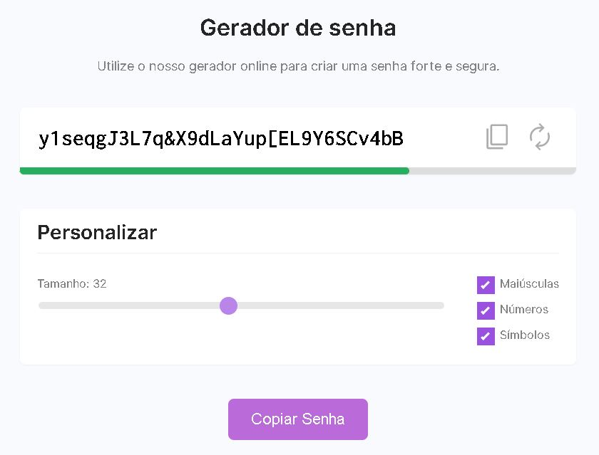

<h1 align="center"> Projeto Gerador de Senha </h1>

Projeto de gerador de senha aleatório com filtros, desenvolvido em uma das seções da plataforma DevSamurai.

<a href="#tecnologias">Tecnologias</a>&nbsp;&nbsp;&nbsp;|&nbsp;&nbsp;&nbsp;
<a href="#projeto">Projeto</a>&nbsp;&nbsp;&nbsp;|&nbsp;&nbsp;&nbsp;
<a href="#memo-licença">Licença</a>

 

Imagem da página do Projeto Gerador de Senha (Imagem 1).

 

## Tecnologias

Esse projeto foi desenvolvido com as seguintes tecnologias:

- HTML e CSS
- JavaScript
- Git e Github

## Projeto

O projeto gerador de senha é um projeto em que é possível gerar uma senha aleatória, alterando seu tamanho e selecionando que tipos de caracteres serão incluídos na mesma. Também possui uma barra de segurança, que mostra, para efeitos de demonstração, o quanto que a senha é considerada forte. Além disso, é possível utilizar o botão de "Copiar Senha" para obter a senha gerada, passando-a para a área de transferência, para eventual uso.

## :memo: Licença

Esse projeto está sob licença MIT.

---

Projeto realizado pela DevSamurai e feito e adaptado por Victor Pimenta. [LinkedIn](https://www.linkedin.com/in/victor-cardoso-pimenta-0250371a0/)